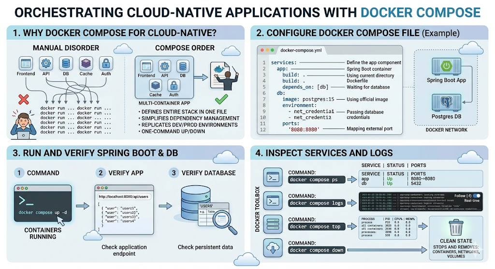

# [4.6] Cloud-Native Applications with Docker Compose

## Lesson Overview

## Dependencies
- [Self Studies](./studies.md)
- [Lesson](./lesson.md)
- [Assignment](./assignment.md)

## Lesson Objectives
* **Explain** why Docker Compose is needed for cloud-native applications
* **Configure** a Docker Compose file to run multiple containers
* **Run and verify** a Spring Boot application and database using Docker Compose
* **Inspect** running services and logs using Docker Compose commands

## Lesson Plan

| Duration | What | How or Why |
|----------|------|------------|
| 10 min | Warm up | Intro and lesson overview, verify prerequisites |
| 20 min | Part 1: Why Docker Compose? | Problem with multiple containers, manual vs Compose approach |
| 10 min | Activity 1 — Why does this matter? | Group discussion on team consistency and onboarding |
| 10 min | Part 2: Demo scenario | Architecture overview — Spring Boot + PostgreSQL |
| 15 min | Part 3: Add dependencies | Add PostgreSQL driver and Spring Data JPA to pom.xml |
| 15 min | Part 4: Configure application properties | Environment variable-based datasource config, JPA properties |
| 10 min | Part 5: Build the project | Maven build, verify JAR exists |
| 30 min | Part 6: Create docker-compose.yml | Write Compose file, understand each section, Dockerfile vs Compose |
| 10 min | Activity 2 — Read the Compose file | Learners interpret the Compose file and answer questions |
| 20 min | Part 7: Run with Docker Compose | Start services, verify containers, understand infrastructure-first approach |
| 15 min | Part 8: Check logs and test | View app and DB logs, test /hello endpoint |
| 10 min | Part 9: Docker Compose commands | Start, stop, rebuild, monitor, exec commands overview |
| 20 min | Activity 3 — Update database config | Learners change DB name, rebuild, verify, test endpoint |
| 10 min | Recap and wrap up | Key takeaways, clean up, preview next lesson, Q&A |
| **Total** | | **175 min — allows ~5 min buffer** |